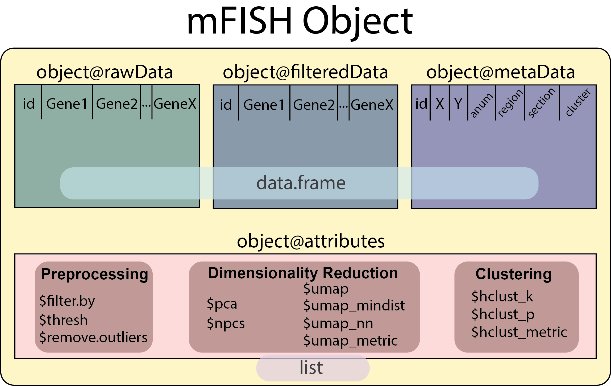

<!-- README.md is generated from README.Rmd. Please edit that file -->

# RUHi 

#### R-based Utilities for HiPlex

<!-- badges: start -->

[](https://www.tidyverse.org/lifecycle/#experimental)
[](https://CRAN.R-project.org/package=RUHi)
<!-- badges: end -->

The goal of RUHi is to analyze and visualize mFISH\! Stay tuned for
exciting features such as *integration with scRNA-seq data*\!  

## Table of Contents:  
1.  [Installation](#installation)   
2.  [Tutorial](#tutorial)
3.  [Function List](#functions)


## Installation

This repo contains the developer's version of RUHi.  
You can install RUHi from this github repo with:

``` r
devtools::install_github("kaitsull/RUHi")
```

Once installed, load the package normally:

``` r
library(RUHi)
```

If you are updating to a newer version of the repo:  

``` r  
#remove old version
remove.packages(RUHi)  

#reinstall from here or from the cembrowskilab/RUHi github  
devtools::install_github("kaitsull/RUHi")  
```
  
 
## Tutorial

``` r
# Kaitlin Sullivan 2022


###### SETTING UP ######

#after following the installation instructions...
#load package
library(RUHi)

#set the wd to your file (using an example dataset present within this repo)
library(here)
setwd(here("data"))

#check out what a function does via:
#   ?ruMake   (in the console)


####### STEP 1a: READING FILES FROM FIJI QUANTIFICATION #########
#here we are using an example dataset from our 2021 eLife paper - https://elifesciences.org/articles/68967

mydata <- ruRead(getwd(), region = "intermediate", anum = "123456", section = "1")

#make sure all your genes are names correctly before continuing
#you should have columns named X,Y,id,region,section,anum and all of your genes
head(mydata)

#feel free to add extra metadata for your section at this point with dplyr::mutate()


####### STEP 1b: COMBINING MULTIPLE SECTIONS #######
#if you have multiple sections you can save multiple experiments as a data.frame using ruRead()
#to combine them use: 

# combo <- ruCombine(c(data1, data2, data3))


######### STEP 2: CREATE YOUR OBJECT #########
#take your individual section or combined dataset and turn it into an mFISH object for analysis

myobj <- ruMake(myobj)


######### STEP 3 VERSION A: "Auto-Analysis" SHINY APP ########
#for a quick analysis overview to get a feel for what variable values will work best, run the shiny app 
#you will have an option to save your object as a .RDS file, which you can later load into R and run further plotting, analysis, etc on

#you have optional time-saving arguments that can pre-select the filtering value and number of clusters prior to running the app

#goFISH(myobj, filter.by = 'Slc17a7', k = 7)

#when you are happy with the way your analysis looks, press "Download Object"
#to read back in your saved .RDS file, simply use:
# myobj <- readRDS(path/to/object)

#you can then skip straight to the plotting steps - or redo other steps if you want


######### STEP 3 VERSION B: "Manual-Analysis" #########
#These steps happen automatically within the Shiny App
#doing them manually simply gives you more autonomy over the individual steps

### FILTERING
#here we filter for excitatory cells which are Slc17a7+
myobj <- ruFilter(myobj, filter.by = 'Slc17a7', threshold = 0.1)

### PREPROCESSING
#run normalization and PCA (with optional arg to remove autofluorescent cells)
myobj <- ruProcess(myobj)

### RUN UMAP
#populate attributes with UMAP for plotting
myobj <- ruUMAP(myobj)

### CLUSTER 
#populate metaData with cluster column
myobj <- ruCluster(myobj, k = 7)


#you can continually re-run these functions until you get an analysis that you are happy with
#it is HIGHLY SUGGESTED you save your object, this way you can share your data and all of the parameters used to get there

#### SAVE VIA: saveRDS(path, myobj)
#### READ IN VIA: myobj <- readRDS(path)
```

``` r
######### STEP 4: PLOTTING #########

### GEOGRAPHIC SPACE with plotSpace()
#plot in space - automatically coloured by cluster
plotSpace(myobj)

#optional args to group by section, or other variable (eg cluster)
plotSpace(myobj, group.by = 'cluster')

#plot in space but change to a gene or metadata value
plotSpace(myobj, colour.by = 'Ctgf', include.fil = F)

#plot in space with separation by cluster (group.by is useful for viewing multiple sections as well)
plotSpace(obj, group.by = 'cluster', colour.by = 'Ctgf')


### DIM REDUCED SPACE with plotDim()
#auto coloured by cluster
plotDim(myobj)

#option to colour by gene/metadata 
plotDim(myobj, colour.by='Ctgf')

### MARKER GENE BOX PLOTS

#Plot a gene's expression across clusters
geneBoxPlot(obj, 'Ctgf')

#Plot the gene expression profile of a specified cluster
clusterBoxPlot(obj, clus='5')

#or simply plot the gene expression for every cluster
clusterBoxPlot(obj)

```
     
## The mFISH Object  
  
RUHi makes use of an `mFISH Object` that encapsulates the many stages of one's analysis for easy reproducibility.   
  
The `mFISH Object` contains 4 main elements:  
  - `@rawData`: _A data frame containing unfiltered non-normalized data_  
  - `@filteredData`: _A data frame containing filtered and normalized data_  
  - `@metaData`: _A data frame containing metadata for each cell_  
  - `@attributes`: _A list containing all of the analysis values utilized_  
  
  


Each core function within the package interacts with the elements of the object so you don't have to.  
However, if you wish to do more advanced analysis, you can access each element by using the `@` accessor (eg: `object@metaData`). From there you can subset like a regular `data.frame` or `list` with the `$` accessor (eg: `object@attributes$pca`).
 
## Functions

Currently the package has **7 core functions**, **4 plotting functions**, and a **Shiny App deployment function**:


## Core Functions

### `ruRead`

  - takes quantified tables from FIJI and combines them into a table for
    analysis
  - **NOTE:** if you do not specify region, section, anum, they will be filled with values `NA`. It is highly suggested to fill in these optional arguments with  
      - section = experiment number in quotations (eg: "4")  
      - region = region images (eg: "anterior")  
      - anum = animal number in quotations (eg: "123456")  
  
### `ruCombine`

  - takes multiple rounds from `ruRead()` and stitches them together with unique ids

### `ruMake`

  - creates an mFISH object from tables generated by `ruRead()` or `ruCombine()`
  - populates the `@rawData` and `@metaData` elements of the mFISH object  
  - **NOTE:** if you are reading in a pre-existing dataframe with gene expression data, these tables must include the metadata columns: X,Y,id,section,region,anum
  
### `ruFilter`

  - filter data by a gene at a certain threshold eg(`ruFilter(object, 'Slc17a7', 0.1)`)
  - populates the `@filteredData` element of the mFISH object

### `ruProcess`

  - normalize and run PCA
  - optional argument to remove outliers that are autofluorescent and therefore express every gene
      - `remove.outliers = c(0,11)` would remove cells expressing no genes or expressing every gene (assuming 12 genes with one filtered out)   
  - alters the `@filteredData` element of the mFISH object  

### `ruUMAP`

  - run a UMAP on the PCA (with option to select number of pcs and alter the hyperparameters of the UMAP)

### `ruCluster`
  
  - cluster the data via hierarchical clustering  
  - populates a cluster column within the `@metaData`  

### `goFISH`

  - launches the gone mFISHing shiny app
  - App is best used for quickly looking through single sections as it gets slower computationally the larger your data is 
  - (**NOTE**: must use object
    generated via ruMake)
    
## Plotting Functions  
  
### `plotSpace`  

  - plot an object in geographic space, coloured by any gene or metadata variable
  
### `plotDim`  
  
  - plot an object in dimensionally reduced space, coloured by any gene or metadata variable
  
### `geneBoxPlot`  
  
  - plot a boxplot of a given gene per cluster  
  
### `clusterBoxPlot`  
  
  - plot a boxplot of all the genes in a given cluster
  


##### Plus original functions by Mark Cembrowski:

`loadData`, `plotCluster`, `plotGene`, `plotViolin`

You can also access function documentation via:

``` r
help(goFISH())

#or

?goFISH()
```

