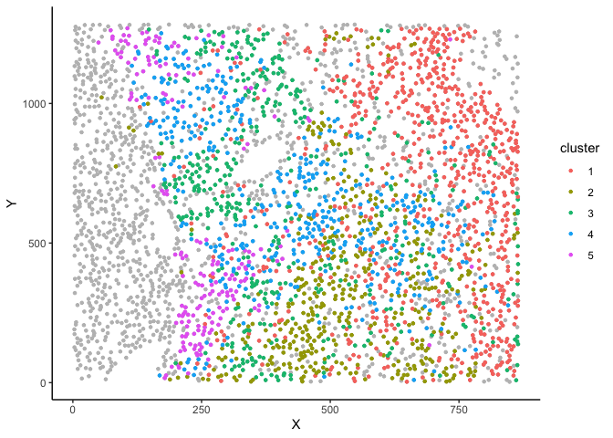
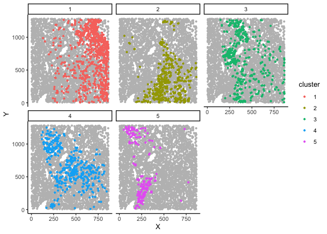
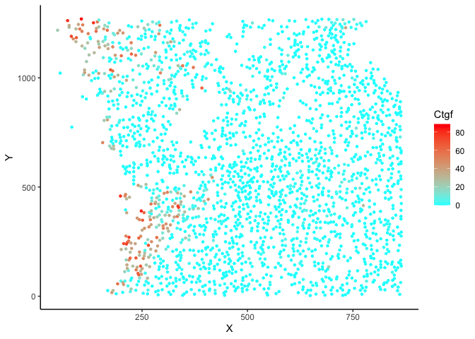
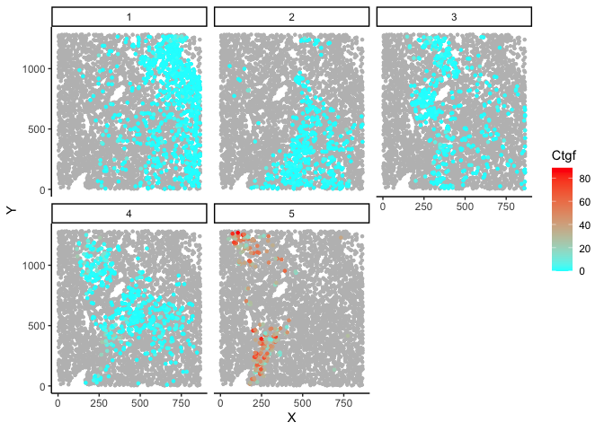
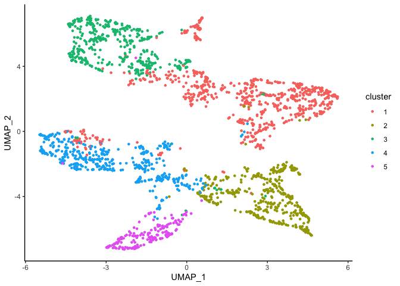
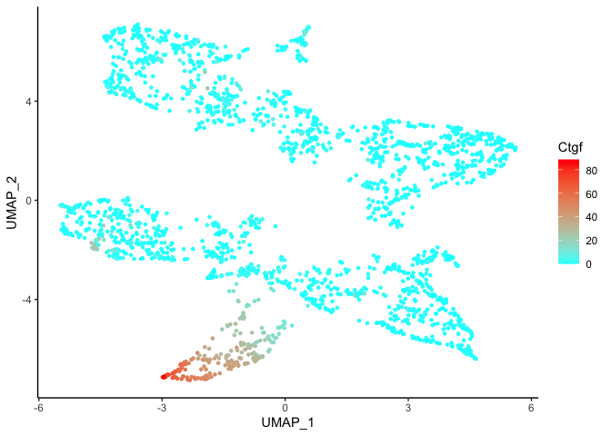
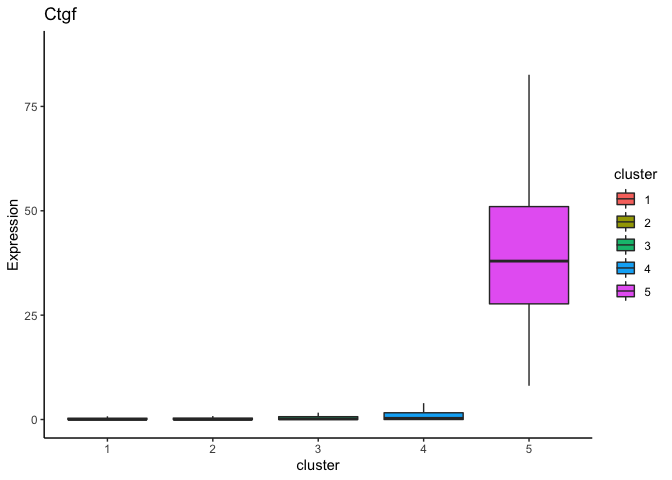
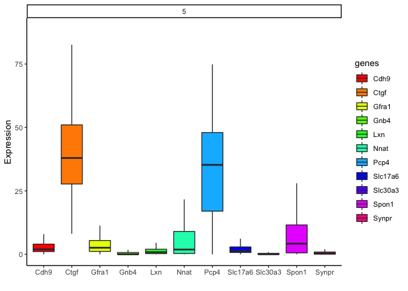
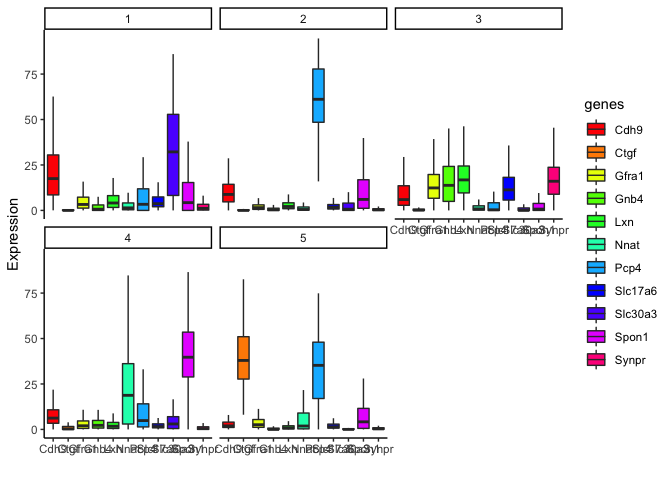

<!-- README.md is generated from README.Rmd. Please edit that file -->

# RUHi 

#### R-based Utilities for HiPlex

<!-- badges: start -->

[](https://www.tidyverse.org/lifecycle/#experimental)
[](https://CRAN.R-project.org/package=RUHi)
<!-- badges: end -->

The goal of RUHi is to analyze and visualize mFISH! Stay tuned for
exciting features such as *integration with scRNA-seq data*!

## Table of Contents:

i.      [Installation](#installation)  
ii.     [Tutorial](#tutorial)  
        -       [1. Setting Up](#setting-up)  
        -       [2. Reading the Data](#reading-the-data)  
        -       [3. Create an mFISH Object](#create-an-mfish-object)  
        -       [4. Go FISH!](#preview-your-analysis)  
        -       [5. Run the Analysis](#run-the-analysis)  
        -       [6. Visualizing](#plotting)   
        -      [7. Saving your Data](#object-storage)  
iii.    [Function List](#functions)  

## Installation

This repo contains the developer’s version of RUHi.  
You can install RUHi from this github repo with:

``` r
devtools::install_github("kaitsull/RUHi")
```

Once installed, load the package normally:

``` r
library(RUHi)
```

If you are updating to a newer version of the repo:

``` r
#remove old version
remove.packages(RUHi)  

#reinstall from here or from the cembrowskilab/RUHi github  
devtools::install_github("kaitsull/RUHi")  
```

## Tutorial

### 1. Setting Up

We will be using a single section dataset from [our 2021 eLife
paper](https://elifesciences.org/articles/68967).  
Raw files used for this analysis are directly from FIJI Quantification
and can be found in [this
repo](https://github.com/kaitsull/RUHi/tree/master/inst/extdata).

``` r
#load package
library(RUHi)
```

### 2. Reading the Data

#### 2a. Read Individual Images

We will use `ruRead()` to read multiple FIJI Quantification files into a
single data frame. Then we can optionally use `ruCombine()` to
concatenate multiple data frames from separate experiments.  
  
First read your quantified gene tables from your `analyzedTables` folder into a single data frame.  
  
When using `ruRead` please specify:  
    -   `region`: where is this image? (eg: "intermediate_claustrum")  
    -   `anum`: animal number  
    -   `section`: a unique identifying number for your image  
   
``` r
#create a data frame
mydata <- ruRead("~/RUHi/inst/extdata", region = "intermediate", anum = "123456", section = "1")

#make sure all your genes are names correctly before continuing
#you should have columns named:
#X,Y,id,region,section,anum and all of your genes
head(mydata)
```

#### 2b. Combine Multiple Images  
If you have multiple sections to analyze, read them individually into data frames and then use `ruCombine()` as shown below:  
  
``` r
#combine a list of data frames from ruRead()
combo <- ruCombine(list(data1, data2, data3))
```

### 3. Create an [mFISH Object](#mfish-objects)
This is a [special class of object](#mfish-objects) that encapsulates both raw and analyzed data as well as important metadata from the analysis. This makes for more reproducible analyses!  
    
``` r
#turn an individual section or combination of sections into an object for analysis
myobj <- ruMake(mydata)
```

### 4. Preview your analysis  
To "auto-analyze" your data, use `goFISH()`. This function launches a ShinyApp that will allow you to easily test out variable values and visualize your analysis - as well as download `.eps` versions of the figures.  
  
__Note: this function works best with a single image or a few combined, however it will begin to get quite slow the more data you put in!__   
  
  
``` r
#you have optional time-saving arguments that can pre-select the filtering value and number of clusters prior to running the app

goFISH(myobj, filter.by = 'Slc17a7', k = 5)

#when you are happy with the way your analysis looks, press "Download Object"
#to read back in your saved .RDS file, simply use:
myobj <- readRDS(path/to/object)
```

### 5. Run the Analysis

#### 5a. Filtering Cells  
  
``` r
#here we filter for excitatory cells which are Slc17a7+
myobj <- ruFilter(myobj, filter.by = 'Slc17a7', threshold = 0.1)
```

#### 5b. Preprocessing  
  
```r
#run normalization (with optional arg called remove.outliers to remove autofluorescent cells)
myobj <- ruProcess(myobj)
```

#### 5c. Dimensionality Reduction  
  
```r
#run a PCA and a UMAP - the values for which are found in myobj@attributes
myobj <- ruUMAP(myobj)
```

#### 5d. Clustering  
  
```r
#populate metaData with cluster column
myobj <- ruCluster(myobj, k = 5)
```

### 6. Plotting

#### 6a. Geographic Space
Plot in X,Y space with `plotSpace()`:

``` r
Automatically coloured by cluster
plotSpace(myobj)
```


  
  
  
  
Optional argument `group.by` to group by section, animal number, or other variable (eg cluster):  
  
``` r
plotSpace(myobj, group.by = 'cluster')
```


  
  
  
Optional argument `colour.by` to colour data by gene expression or metadata values:  
  
``` r
#plot in space but change to a gene or metadata value
plotSpace(myobj, colour.by = 'Ctgf', include.fil = F)
```


  
  
  
  
Combine multiple arguments to get a better feel for how the data looks:  
  
``` r
#plot in space with separation by cluster (group.by is useful for viewing multiple sections as well)
plotSpace(myobj, group.by = 'cluster', colour.by = 'Ctgf')
```


  
  
  
   
   
#### 6b. Dimensionally Reduced Space
Plot in UMAP space with `plotDim()`:  
  
``` r
#auto coloured by cluster
plotDim(myobj)
```


  
  
  
This also has the `colour.by` option for gene expression and metadata:  
  
``` r
#option to colour by gene/metadata 
plotDim(myobj, colour.by='Ctgf')
```


  
  
  
  
  
#### 6c. Box Plots  
Plot expression of a gene in a given cluster using `geneBoxPlot()`:  
  
``` r
#coloured by cluster ID
geneBoxPlot(myobj, 'Ctgf')
```


  
  
  
  
Plot expression of all genes in a given cluster with `clusterBoxPlot()`:   
  
``` r
#autogenerated rainbow colouring scheme for genes
clusterBoxPlot(myobj, clus='5')
```


  
    
   
    
You can also print the expression of *every* gene in *every* cluster with this:      
    
``` r
#autogenerated rainbow colouring scheme for genes
clusterBoxPlot(myobj)
```
  
  
  

#### 7. Object Storage  
It is **HIGHLY SUGGESTED** that you save your object, this way you can share your data and all of the parameters used to get there in a reproducible manner. You can continually re-run these functions until you get an analysis that you are happy with. Then save and load your data as follows:   
  
``` r
#### SAVE VIA: saveRDS(path, myobj)
#### READ IN VIA: myobj <- readRDS(path)
```  
   
   
## mFISH Objects

RUHi makes use of an `mFISH Object` that encapsulates the many stages of
one’s analysis for easy reproducibility.

The `mFISH Object` contains 4 main elements:  
- `@rawData`: *A data frame containing unfiltered non-normalized data*  
- `@filteredData`: *A data frame containing filtered and normalized
data*  
- `@metaData`: *A data frame containing metadata for each cell*  
- `@attributes`: *A list containing all of the analysis values utilized*


Each core function within the package interacts with the elements of the
object so you don’t have to.  
However, if you wish to do more advanced analysis, you can access each
element by using the `@` accessor (eg: `object@metaData`). From there
you can subset like a regular `data.frame` or `list` with the `$`
accessor (eg: `object@attributes$pca`).

## Functions

Currently the package has **7 core functions**, **4 plotting functions**, and a **Shiny App deployment function**:

## Core Functions

### `ruRead`

-   takes quantified tables from FIJI and combines them into a table for
    analysis
-   **NOTE:** if you do not specify region, section, anum, they will be
    filled with values `NA`. It is highly suggested to fill in these
    optional arguments with
    -   section = experiment number in quotations (eg: “4”)  
    -   region = region images (eg: “anterior”)  
    -   anum = animal number in quotations (eg: “123456”)

### `ruCombine`

-   takes multiple rounds from `ruRead()` and stitches them together
    with unique ids

### `ruMake`

-   creates an mFISH object from tables generated by `ruRead()` or
    `ruCombine()`
-   populates the `@rawData` and `@metaData` elements of the mFISH
    object  
-   **NOTE:** if you are reading in a pre-existing dataframe with gene
    expression data, these tables must include the metadata columns:
    X,Y,id,section,region,anum

### `ruFilter`

-   filter data by a gene at a certain threshold
    eg(`ruFilter(object, 'Slc17a7', 0.1)`)
-   populates the `@filteredData` element of the mFISH object

### `ruProcess`

-   normalize and run PCA
-   optional argument to remove outliers that are autofluorescent and
    therefore express every gene
    -   `remove.outliers = c(0,11)` would remove cells expressing no
        genes or expressing every gene (assuming 12 genes with one
        filtered out)  
-   alters the `@filteredData` element of the mFISH object

### `ruUMAP`

-   run a UMAP on the PCA (with option to select number of pcs and alter
    the hyperparameters of the UMAP)

### `ruCluster`

-   cluster the data via hierarchical clustering  
-   populates a cluster column within the `@metaData`

### `goFISH`

-   launches the gone mFISHing shiny app
-   App is best used for quickly looking through single sections as it
    gets slower computationally the larger your data is
-   (**NOTE**: must use object generated via ruMake)

## Plotting Functions

### `plotSpace`

-   plot an object in geographic space, coloured by any gene or metadata
    variable

### `plotDim`

-   plot an object in dimensionally reduced space, coloured by any gene
    or metadata variable

### `geneBoxPlot`

-   plot a boxplot of a given gene per cluster

### `clusterBoxPlot`

-   plot a boxplot of all the genes in a given cluster

##### Plus original functions by Mark Cembrowski:

`loadData`, `plotCluster`, `plotGene`, `plotViolin`

You can also access function documentation via:

``` r
help(goFISH())

#or

?goFISH()
```
